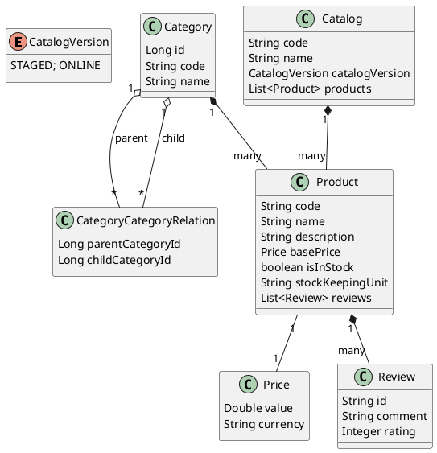

# Entity Relationship UML Diagram

This document describes the entity relationships for the Product Catalog domain model.

## Entities & Attributes

**Product**
- code (String, unique)
- name (String)
- description (String)
- basePrice (Price)
- isInStock (boolean)
- stockKeepingUnit (String)
- reviews (List<Review>)

**Category**
- id (Long)
- code (String)
- name (String)
- description (String)
- products (List<Product>)

**CategoryCategoryRelation** (Join table for Category self many-to-many)
- parentCategoryId (Long)
- childCategoryId (Long)

**Price**
- value (Double)
- currency (String)

**Catalog**
- code (String)
- name (String)
- catalogVersion (CatalogVersion: STAGED, ONLINE)
- products (List<Product>)

**Review**
- id (String)
- comment (String)
- rating (Integer)

## Relationships
- Category 1 — * Product (One category has many products)
- Category * — * Category (Many-to-many self-relationship via CategoryCategoryRelation)
- Product 1 — 1 Price (Each product has one price)
- Product 1 — * Review (One product can have many reviews)
- Catalog 1 — * Product (One catalog has many products)

## UML Diagram (PlantUML)

---

You can use the above PlantUML code to generate a graphical UML diagram using any PlantUML-compatible tool.
